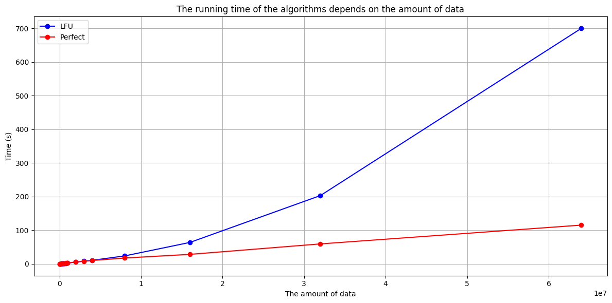
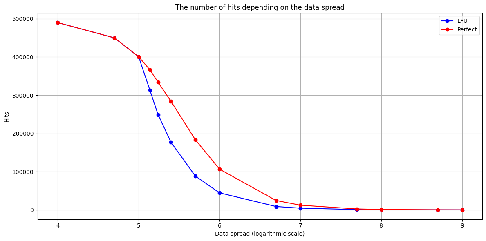

# Cache Project: LFU-cache and Perfect-cache

## Описание
Проект создан в рамках курса по C++ Константина Владимирова и реализует два типа кэшей:
1. **LFU (Least Frequently Used) Cache** — кэш с заменой наименее часто используемых страниц.
2. **Perfect Cache** — идеальный кэш, который всегда знает, какая страница будет использована позже всех и удаляет её первой.

## Компиляция
```
cd LFUCache/
cmake -S ./ -B build/
cmake --build build
cd build/
```

Запуск проекта:
```
./lfu_cache < path_to_test
./perfect_cache < path_to_test
./google_test
```

Также в проекте реализованы макросы `DEBUG` и `TIME`, которые можно использовать для вывода отладочной информации и замеров времени работы кэша. Для активации макросов нужно добавить соответствующие `#define` в исходный код перед компиляцией.

## Структура проекта
- **src/**: содержит исходные файлы с реализациями кэшей и тестов:
  - `lfu_cache.cpp`
  - `perfect_cache.cpp`
  - `google_test.cpp`
- **include/**: содержит заголовочные файлы для кэшей:
  - `lfu_cache.hpp`
  - `perfect_cache.hpp`
- **tests/**: содержит тесты для проверки производительности и адекватности работы кэшей.

## Ввод/вывод
На вход программа принимает `cacheSize` — размер кэша, `pagesNum` — количество страниц, передаваемых на вход, и сами страницы через пробел.

На выходе получаем число — количество попаданий.

## Сравнение кэшей
В качестве инварианта в сравнении кэшей мы будем считать машину, на которой сравнение и будет происходить (то есть производительность не меняется в течение всех экспериментов). В качестве же варьируемых характеристик кэша возьмём **количество данных**, **разброс данных**, **размер кэша**. 

И поступим мы так: будем считать кэш некоторым черным ящиком, который представляется неявной функцией трех переменных. Но чтобы хоть как-то сравнить между собой в двумерном подпространстве характеристик LFU-cache и Perfect-cache, мы будем вынуждены поставить в конкретном опыте две варьируемые характеристики постоянными, а третью менять в таком диапазоне, чтобы получаемая зависимость либо имела конкретный смысл, либо было явно разбросана случайно. Для каждого эксперимента построим графики.

### Вариация количества данных при неизменных размере кэша (10000) и разброс данных (20000):



| **Кол-во данных** | **Время работы, c (LFU)** | **Время работы, c (Perfect)** |
|:-----------------:|:-------------------------:|:-----------------------------:|
| 50000             | 0,13                      | 0,19                          |
| 100000            | 0,23                      | 0,31                          |
| 200000            | 0,51                      | 0,68                          |
| 300000            | 0,69                      | 0,95                          |
| 400000            | 0,94                      | 1,23                          |
| 500000            | 1,18                      | 1,40                          |
| 600000            | 1,43                      | 1,68                          |
| 800000            | 1,94                      | 2,36                          |
| 1000000           | 2,45                      | 2,95                          |
| 2000000           | 5,55                      | 5,78                          |
| 3000000           | 8,60                      | 7,82                          |
| 4000000           | 10,64                     | 10,17                         |
| 8000000           | 23,77                     | 17,52                         |
| 16000000          | 63,80                     | 28,36                         |
| 32000000          | 202,97                    | 59,41                         |
| 64000000          | 699,67                    | 115,27                        |


### Вариация разброса данных при неизменных количестве данных (1000000) и размере кэша (100000):



| **Разброс данных** | **Кол-во хитов (LFU)** | **Кол-во хитов (Perfect)** |
|:------------------:|:----------------:|:----------------:|
| 10000              | 489999           | 489999           |
| 50000              | 450002           | 450002           |
| 100000             | 400667           | 400730           |
| 137500             | 312640           | 366229           |
| 175000             | 249200           | 334066           |
| 250000             | 176950           | 283982           |
| 500000             | 88751            | 183850           |
| 1000000            | 44590            | 106628           |
| 5000000            | 8778             | 24529            |
| 10000000           | 4510             | 12282            |
| 50000000           | 885              | 2477             |
| 100000000          | 462              | 1193             |
| 500000000          | 96               | 256              |
| 1000000000         | 43               | 112              |


### Вариация размера кэша при неизменных количестве данных (1000000) и разбросе (20000):

.png)
.png)


| **Размер кэша (LFU)** | **Кол-во хитов (LFU)** | **Размер кэша (Perfect)** | **Кол-во хитов (Perfect)** |
|:---------------------:|:----------------------:|:-------------------------:|:--------------------------:|
| 100000                | 1872                   | 1                         | 4                          |
| 200000                | 3564                   | 5                         | 298                        |
| 300000                | 5069                   | 10                        | 493                        |
| 400000                | 6427                   | 50                        | 1244                       |
| 500000                | 7528                   | 100                       | 1791                       |
| 600000                | 8464                   | 500                       | 3897                       |
| 700000                | 9129                   | 1000                      | 5293                       |
| 800000                | 9633                   | 1800                      | 6747                       |
| 900000                | 9940                   | 2700                      | 7647                       |
| 1000000               | 10013                  | 3800                      | 8747                       |
| 1100000               | 10013                  | 4400                      | 9347                       |
| 1200000               | 10013                  | 5000                      | 9947                       |
| 1300000               | 10013                  | 7500                      | 10013                      |
| 1400000               | 10013                  | 10000                     | 10013                      |


В заключение отметим: 
- на большом количестве данных при ~одинаковом количестве попаданий, идеальный кэш работает сильно быстрее, чем LFU.
- на большом разбросе данных идеальный кэш показывает себя лучше в середине траектории и почти идентичен LFU на концах траектории.
- при вариации размера кэша идеальный кэш показал себя сильно лучше LFU, что в, общем было, и ожидаемо. Хочется также отметить, насколько сильно данные графики напоминают гиперболический тангенс (без намёков, просто забавно, что похожи).